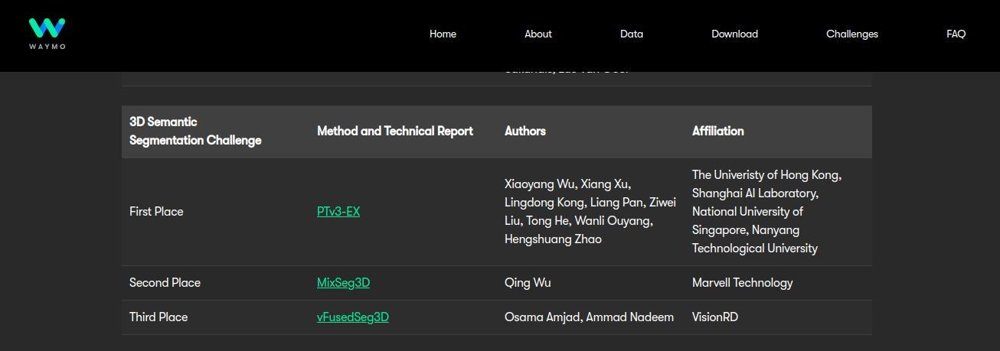
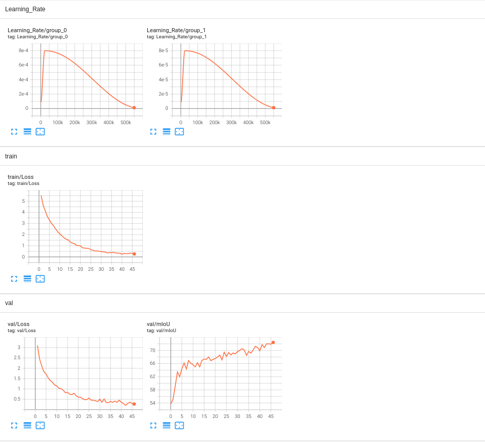
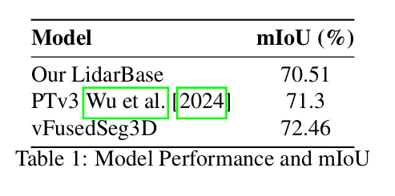

# vFusedSeg3D: 3rd Place Solution for 2024 Waymo Open Dataset Challenge in Semantic Segmentation

## Overview

vFusedSeg3D is a state-of-the-art architecture that won the Waymo Open Challenge 2024 for 3D Semantic Segmentation. This architecture represents a significant advancement in the field of autonomous driving and 3D perception.

## Key Highlights

- **Challenge Achievement**: vFusedSeg3D technical document was presented at [Workshop on Autonomous Driving CVPR 2024](https://cvpr2024.wad.vision/). 

  

- **Challenge Achievement**: vFusedSeg3D achieved first place in the Waymo Open Challenge 2024, demonstrating exceptional performance in 3D semantic segmentation tasks.

- **Technical Document**: Our technical document detailing the architecture and its innovations was accepted at the Workshop on Autonomous Driving at CVPR 2024.

## Architecture

### High-Level Overview

Our architecture uses dual-modal feature extraction to take advantage of the capabilities of both image and LiDAR data, resulting in robust feature representation.

  

### Tensorboard

You can visualize our [Tensorboard](https://huggingface.co/Osama99/vFusedSeg3D/tensorboard?params=timeseries#frame). 

### Our Final Results

  

### Key Components

- **[Component 1]**: VFusedSeg3D uses the rich semantic content of the camera pictures and the accurate depth sensing of LiDAR to generate a strong and comprehensive environmental understanding, addressing the constraints inherent in each modality.
- **[Component 2]**: Through a carefully thought-out network architecture that aligns and merges these information at different stages, our novel feature fusion technique combines geometric features from LiDAR point clouds with semantic features from camera images.
- **[Component 3]**: With the use of multimodality techniques, performance has significantly improved, yielding a state-of-the-art mIoU of 72.46% on the validation set as opposed to the prior 70.51%.

### Innovations

- **[Innovation 1]**: First time point based lidar backbone features fused with camera semantic features.
- **[Innovation 2]**: Whole architecture trained on a single RTX 3090 24gigs GPU..

## Technical Document

The detailed technical document which was accepted at CVPR 2024 that explains the vFusedSeg3D architecture is available at:

- [Technical Document PDF](https://cvpr2024.wad.vision/)

## Acknowledgements

We would like to thank the organizers of the Waymo Open Challenge and the Workshop on Autonomous Driving at CVPR 2024 for recognizing our work. Special thanks to our team for their dedication and hard work.

## Contact

For further information, please contact [Your Contact Information].

## License

This project is licensed under the [Your License] License - see the [LICENSE](LICENSE) file for details.

